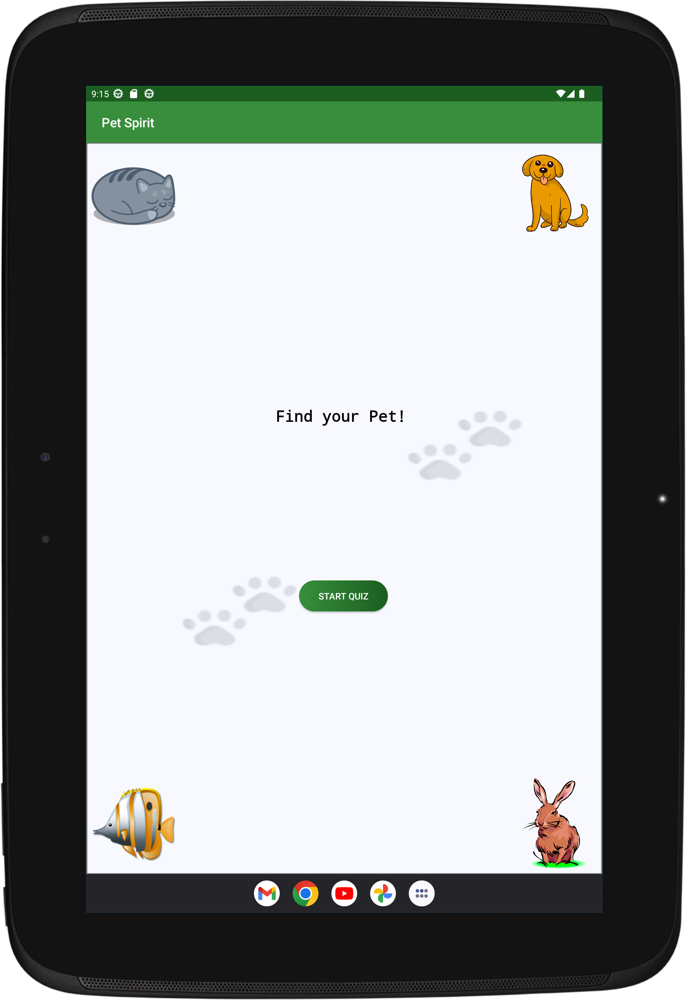
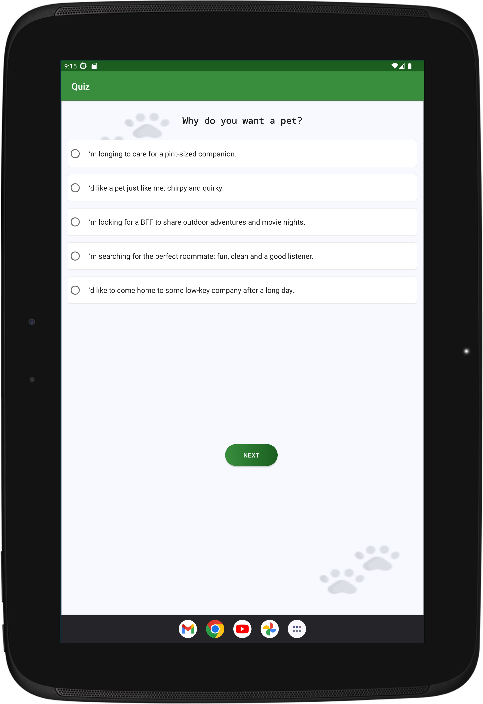
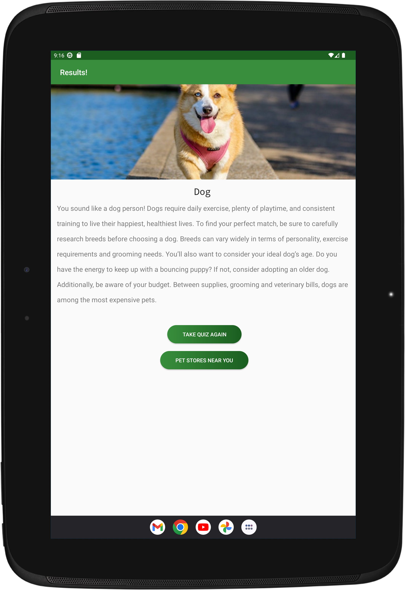

# Pet Spirit
An android app that helps you find out your best pet. It uses a smart survey that matches people and pets based on compatibility. Questions relating to energy, confidence, focus, and independence,
The quiz assesses your personality, lifestyle and home as it relates to pet parenting.

### Phone Display:

  

### Tablet Display
  

## App Architecture
- MVVM
- Java

## Developed By
Nabunya Lilian

Copyright [2022] [Nabunya Lilian]

Licensed under the Apache License, Version 2.0 (the "License");
you may not use this file except in compliance with the License.
You may obtain a copy of the License at

    http://www.apache.org/licenses/LICENSE-2.0

Unless required by applicable law or agreed to in writing, software
distributed under the License is distributed on an "AS IS" BASIS,
WITHOUT WARRANTIES OR CONDITIONS OF ANY KIND, either express or implied.
See the License for the specific language governing permissions and
limitations under the License.

